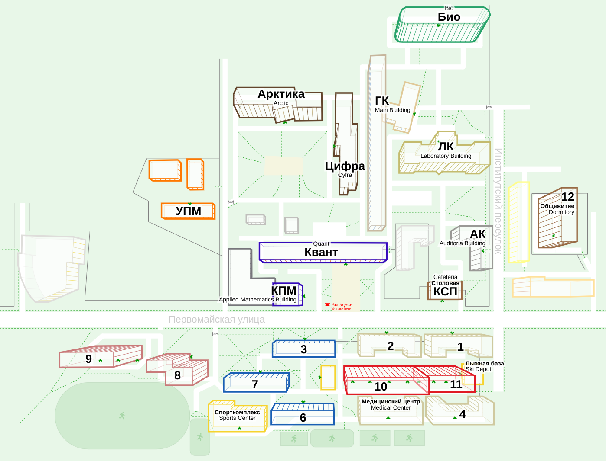

# Редактор карты кампуса МФТИ

Карта призвана помочь новым студентам и гостям университета найти нужный корпус и построить маршрут до него. Предназначена для размещения на уличных пилонах и щитах.

Редактор карты призван облегчить её дорисовку при дальнейшем развитии кампуса (например, при строительстве новых корпусов), гарантируя при этом целостность дизайна.

## [Демо](http://cromtus.ru/campus)

## Основные заложенные принципы
1. **Умеренный реализм**: раскраска зданий напоминает их настоящий внешний вид, но не имитирует его полностью. То же самое касается и высоты.
2. **Центральная проекция** относительно отметки "Вы здесь" обнажает у каждого здания ровно ту сторону, которая будет видна наблюдателем в жизни.
3. **Отсутствие легенды**: все подписи находятся непосредственно рядом с объектами.
4. **Пешеходная ориентированность**: нарисованы все тропинки, заборы и входы в здания.

## Перспективы
Проект накидан на коленке, намеренно не доведён до конечного состояния и служит исключительно в качестве proof-of-concept.
Напишите мне в Телеге (ник: `cr0mtus`), если считаете, что его можно было бы развить на благо Физтеха (особенно жду писем от команды навигации Студсовета).

## Дисклеймер
Содержит ИИ-сгенерированный код в больших количествах. И баги.